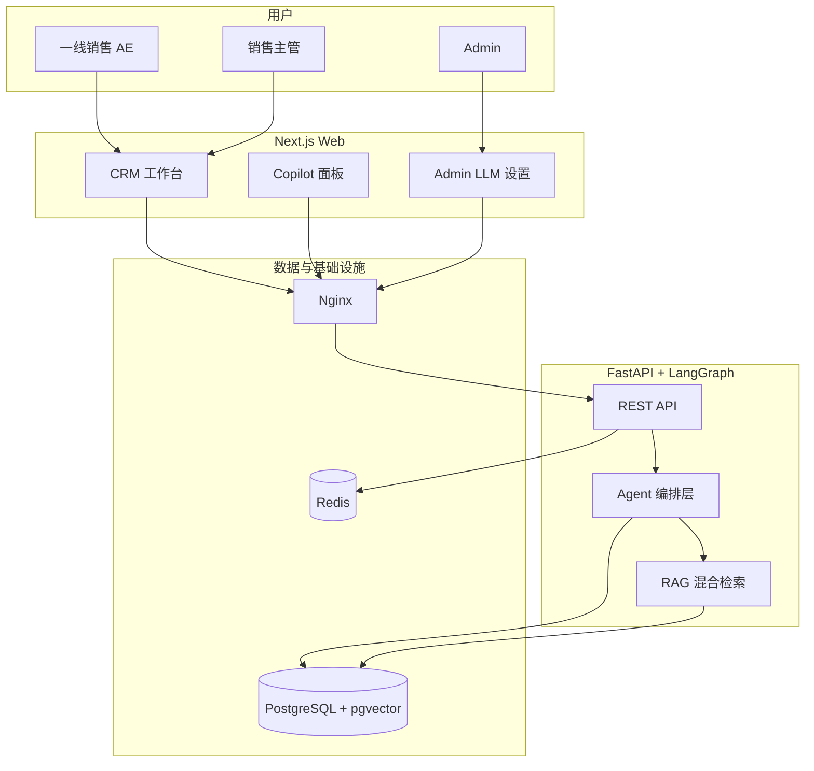
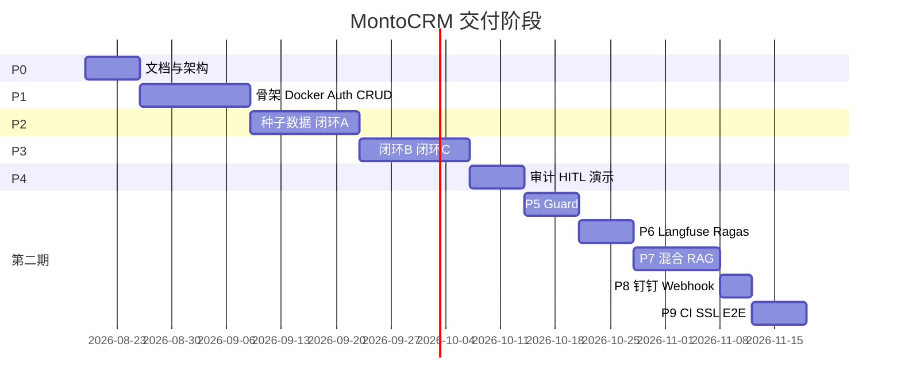

# MontoCRM — AI 原生 B2B 大客户 CRM

> 会记忆、会提醒、会起草、关键动作等人拍板的 B2B 销售作战系统。

| 属性 | 说明 |
|---|---|
| 场景 | B2B 大客户 / 项目型销售（工业软件、智能制造 ToB） |
| 文档版本 | v2.0.0（第二期 P5–P9） |
| 当前阶段 | **P9 / 第二期完成** |

CI：工作流见 [`.github/workflows/ci.yml`](.github/workflows/ci.yml)。

[](https://github.com/kk112244199-pixel/crm/actions/workflows/ci.yml)


---

## 快速开始

```bash
# 1. 克隆并配置环境变量
git clone <repo_url> && cd CRM
cp .env.example .env
# 编辑 .env，填入 DASHSCOPE_API_KEY（可不填，用 mock 模式）

# 2. 启动所有服务（首次约 3-5 分钟拉取镜像）
docker compose up -d

# 3. 等待 DB 就绪后执行迁移
docker compose exec api alembic upgrade head

# 4. 写入种子用户 + 演示数据
docker compose exec api python seed_users.py
docker compose exec api python seed_crm_data.py

# 5. 验证服务
curl http://localhost:8000/health
# → {"status":"ok","app":"MontoCRM","version":"2.0.0"}
# 经 Nginx：https://localhost:18443/ （自签；本机 Apache 占 443 时用 18443，curl -k）
```

| 服务 | 地址 |
|---|---|
| 前端 (Next.js) | http://localhost:3000 |
| API (FastAPI) | http://localhost:8000 |
| Nginx HTTPS | https://localhost （:443；本机被占用时见 `.env` `NGINX_HTTPS_PORT`） |
| Swagger 文档 | http://localhost:8000/docs |
| Prometheus 指标 | http://localhost:8000/metrics |
| Grafana | http://localhost:3001 （admin / admin） |
| Prometheus | http://localhost:9090 |

**默认账号**

| 角色 | 邮箱 | 密码 |
|---|---|---|
| Admin | admin@montocrm.local | Admin@123! |
| Manager | manager@montocrm.local | Manager@123! |
| AE | ae@montocrm.local | AE@123! |

> 完整演示步骤见 [docs/deployment/demo-script.md](docs/deployment/demo-script.md)

### 评估（P6）

```bash
# 仓库根目录（需 make）；Windows 也可用下面的 python 命令
make eval
cd apps/api && python -m app.eval.runner --out tests/ragas_report.json
```

无 LLM Key 时使用启发式指标（Faithfulness / Answer Relevancy / Context Recall）。低于阈值只警告、不阻断。Golden：`apps/api/tests/golden/extract_writeback.json`（评测已冻结；口径若与一线不符再改）。

Langfuse：`.env` 填写 `LANGFUSE_PUBLIC_KEY` / `LANGFUSE_SECRET_KEY` 后走官方 SDK；留空则内存 Mock。不要把 Key 提交进 git；CI 故意不配云账号。

真 Ragas LLM：本机 `RAGAS_BACKEND=llm` 且已安装 ragas + Chat Key。GitHub 周评估默认 heuristic，可在 Actions 里 **Run workflow** 立刻跑一轮，产物为 `ragas_report` artifact。

### CI / 测试（P9）

```bash
make test-unit          # 不需要 Postgres
make eval               # 周一 GHA 也会跑；低分只警告
```

本机 `git push` 若 HTTPS 被重置：

```powershell
powershell -File scripts/push.ps1
```

发布镜像：打 tag `v0.2.0` 后工作流 [ghcr.yml](.github/workflows/ghcr.yml) 推 `api` / `web`。集成测需要 pgvector（CI 已带 service）。

---

## 系统概览



---

## MVP 三条闭环

| 闭环 | 说明 | 文档 |
|---|---|---|
| **A** | 会议纪要 → 智能写回 | [business-flow.md](docs/architecture/business-flow.md#闭环-a) |
| **B** | 商机健康度与风险预警 | [business-flow.md](docs/architecture/business-flow.md#闭环-b) |
| **C** | Copilot 查询 + 邮件草稿 + 发送审批 | [business-flow.md](docs/architecture/business-flow.md#闭环-c) |

---

## 文档索引

### 产品与需求

| 文档 | 路径 | 状态 |
|---|---|---|
| 产品需求文档 PRD | [docs/PRD.md](docs/PRD.md) | ✅ v0.6 |

### 架构设计

| 文档 | 路径 | 状态 |
|---|---|---|
| 技术架构 | [docs/architecture/tech-architecture.md](docs/architecture/tech-architecture.md) | ✅ v0.2 |
| Agent 架构 | [docs/architecture/agent-architecture.md](docs/architecture/agent-architecture.md) | ✅ v0.3 |
| 业务流程 | [docs/architecture/business-flow.md](docs/architecture/business-flow.md) | ✅ v0.2 |
| 数据模型 | [docs/architecture/data-model.md](docs/architecture/data-model.md) | ✅ v0.2 |
| 代码结构对照 | [docs/architecture/code-map.md](docs/architecture/code-map.md) | ✅ v0.2 |
| RAG 管道 | [docs/architecture/rag-pipeline.md](docs/architecture/rag-pipeline.md) | ✅ v0.3 |

### 接口契约

| 文档 | 路径 | 状态 |
|---|---|---|
| OpenAPI 3.0 | [docs/api/openapi.yaml](docs/api/openapi.yaml) | ✅ v0.1.1 Draft |

### 阶段核查

| 阶段 | 文档 | 状态 |
|---|---|---|
| P0 文档与架构 | [docs/phases/P0-checklist.md](docs/phases/P0-checklist.md) | 🔄 进行中 |
| P1 骨架与 CRUD | [docs/phases/P1-checklist.md](docs/phases/P1-checklist.md) | ⏳ |
| P2 闭环 A | [docs/phases/P2-checklist.md](docs/phases/P2-checklist.md) | ⏳ |
| P3 闭环 B/C | [docs/phases/P3-checklist.md](docs/phases/P3-checklist.md) | ⏳ |
| P4 企业化与演示 | [docs/phases/P4-checklist.md](docs/phases/P4-checklist.md) | ⏳ |

### 部署与安全

| 文档 | 路径 | 状态 |
|---|---|---|
| Docker 部署 | [docs/deployment/docker-compose.md](docs/deployment/docker-compose.md) | ✅ P9 |
| 安全与 HITL | [docs/security/guardrails-hitl.md](docs/security/guardrails-hitl.md) | ✅ v0.2 |

---

## 技术栈（摘要）

| 层 | 选型 |
|---|---|
| 前端 | Next.js 15、TypeScript、Tailwind |
| 后端 | Python 3.12、FastAPI、LangGraph、LangChain |
| 数据库 | PostgreSQL 16 + pgvector |
| 缓存 | Redis 7 |
| 消息队列 | MVP：Redis/Celery；二期：RabbitMQ（可选） |
| 反向代理 | Nginx |
| 可观测 | MVP：结构化日志；二期：Langfuse、Prometheus + Grafana |
| 安全 | RBAC、HITL、MVP 规则引擎；二期 LLM Guard |
| 部署 | Docker Compose |

详见 [技术架构](docs/architecture/tech-architecture.md)。

---

## 项目阶段路线图



第二期范围与核查：[phase-2-overview.md](docs/phases/phase-2-overview.md) · 需求正文 [PRD §14](docs/PRD.md)

---

## 如何 Review 代码（P1 起）

1. 先看 [code-map.md](docs/architecture/code-map.md) 了解目录与模块职责
2. 对照 [openapi.yaml](docs/api/openapi.yaml) 检查 API 是否与契约一致
3. 对照 [agent-architecture.md](docs/architecture/agent-architecture.md) 检查 LangGraph 节点
4. 每阶段结束勾选对应 [phases/](docs/phases/) 核查清单

---

## License

TBD
