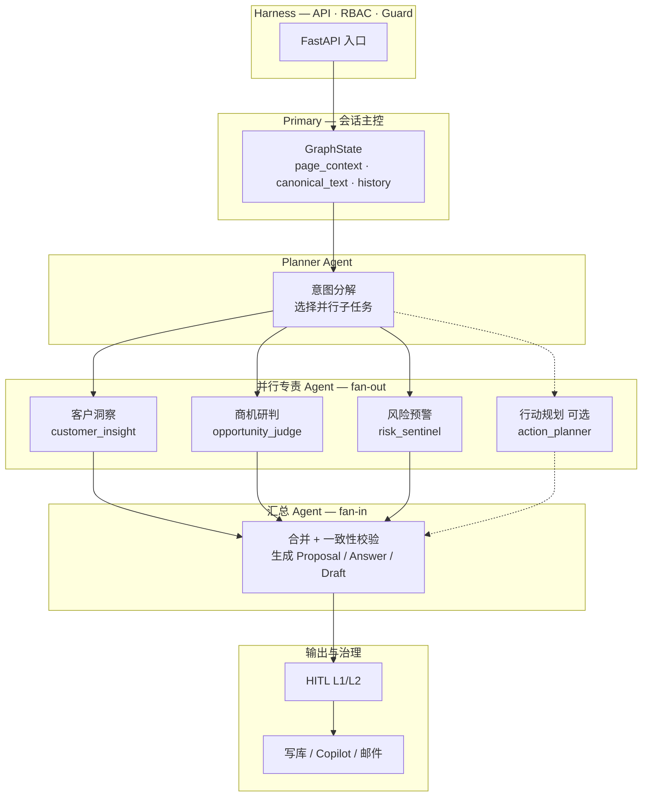
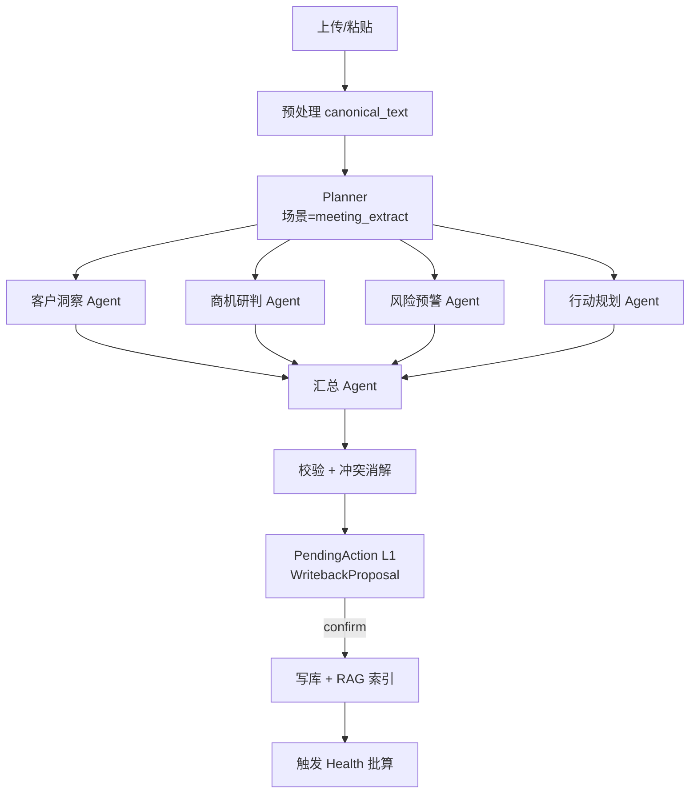
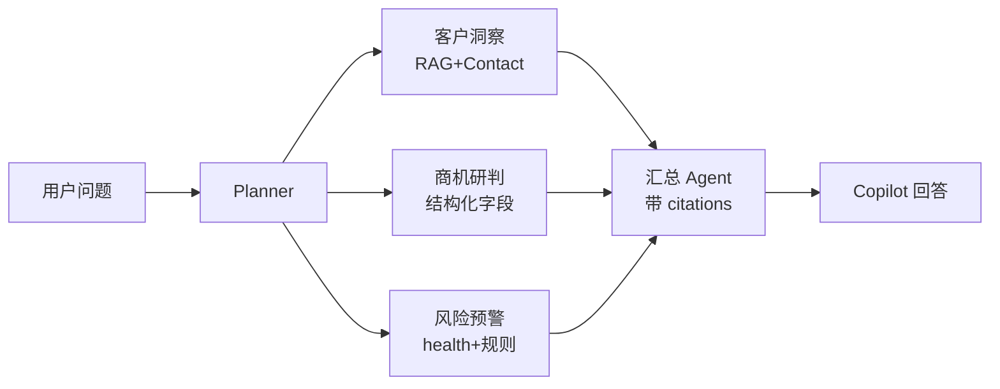
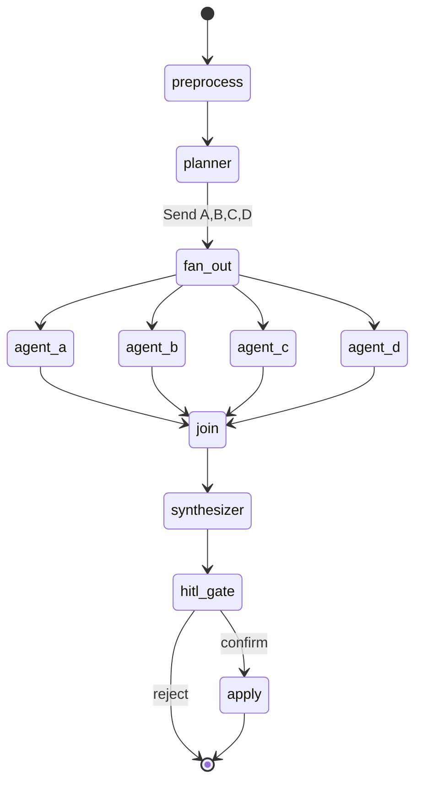
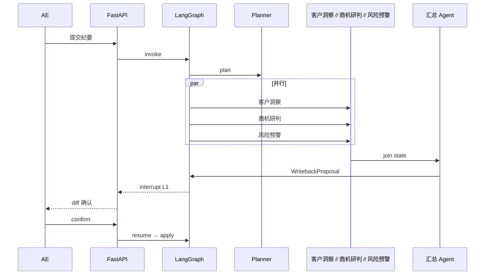

# Agent 架构设计

| 属性 | 内容 |
|---|---|
| 版本 | v0.3 |
| 关联 | [PRD §9](../PRD.md)、[business-flow.md](business-flow.md) |

---

## 1. 设计原则：为什么要 Multi-Agent 并行

**简单串行流水线**（Extract → Writeback → 结束）的问题：

- 纪要里同时涉及 **客户、商机、风险**，一个 Agent 包打天下，质量不稳定  
- 无法体现 MontoForce「数字员工团队」：**分头调研、再汇总**  
- 难以扩展（会前简报、复盘、复杂 Copilot 都要重写流程）

**目标架构**（对齐 MontoForce / 截图模板）：

```text
Harness → Primary → Planner → [客户洞察 ∥ 商机研判 ∥ 风险预警] → 汇总 Agent → HITL/输出
```

| 层次 | 角色 | 说明 |
|---|---|---|
| **Harness** | 编排运行时 | FastAPI 入口、RBAC、Guard、LangGraph checkpoint |
| **Primary** | 会话主控 | thread_id、page context、共享 GraphState |
| **Planner** | 规划 | 解析意图，决定激活哪些专责 Agent、是否并行 |
| **专责 Agent** | 并行子任务 | 客户洞察 / 商机研判 / 风险预警（可扩展 行动规划） |
| **汇总 Agent** | 综合 | 合并并行结果 → Proposal / 回答 / 草稿 |
| **HITL** | 人工闸门 | 写库、发邮件等 L1/L2 动作 |

**Multi-Agent 的优点在这里体现**：

1. **并行提速**：客户洞察/商机研判/风险预警同时跑，P95 接近最慢那路而非三路之和  
2. **专精 Prompt**：每个 Agent 只背一个方法论（决策链 / MEDDIC / 风险规则）  
3. **可审计**：每路输出独立进 state，汇总 Agent 必须引用子 Agent evidence  
4. **可扩展**：新增「竞对分析 Agent」只需 Planner 加一条边，不动汇总逻辑  

---

## 2. 总览架构图（与截图对齐）



LangGraph 实现：`Planner` 后使用 **`Send` API / 条件 fan-out** 并行触发专责 Agent，**`join` 节点** 等待全部完成后进入 `Synthesizer`。

---

## 3. 专责 Agent 定义

| Agent | 代号 | 职责 | 主要工具 | 典型输出 |
|---|---|---|---|---|
| **Planner** | — | 识别场景；决定并行集合 | `get_opportunity`, 意图分类 | `plan: { agents: [...], reasoning }` |
| **客户洞察** | customer_insight | 联系人、决策链、关系变化 | `list_contacts`, `search_memory` | `contact_updates`, `role_changes` |
| **商机研判** | opportunity_judge | 阶段、痛点、预算、竞对 | `get_opportunity`, `search_memory` | `opp_field_updates`, `stage_hint` |
| **风险预警** | risk_sentinel | 规则 H001-H008 + 纪要风险信号 | `get_opportunity`, 规则引擎 | `risk_flags`, `health_deductions` |
| **行动规划** | action_planner | 待办、下一步、跟进节奏 | `search_memory` | `tasks`, `next_best_action` |
| **汇总** | Synth | 合并四路；消冲突；生成最终结构；创建 PendingAction | `build_writeback_proposal`, `create_pending_action` | `WritebackProposal` / `CopilotAnswer` / PendingAction L1 |

**风险预警 Agent（闭环 B）** 既可：

- 作为 **风险预警（risk_sentinel）** 的子能力（纪要 / Copilot 场景），也可  
- **独立批任务** 在写回后对 Opportunity 全量重算（定时 + 事件触发）

---

## 4. 场景编排（三条闭环如何用并行）

### 4.1 闭环 A — 会议纪要 → 智能写回



**与旧设计的区别**：不再有单一「Extract Agent」包打天下；职责**拆分**到客户洞察 / 商机研判 / 风险预警 / 行动规划四路并行，**汇总 Agent** 产出原 WritebackProposal。

**Planner 规则（meeting_extract，MVP 默认）** — 详见 [§15](#15-变弱风险与降级规范-p2-必测)：

- **商机研判必开**（核心商机字段）  
- 纪要 > 200 字 → **客户洞察默认开**；含联系人/职位 → 必开  
- **风险预警默认开**（MVP 宁可多开，避免漏风险）；含风险关键词时必开  
- 含「下一步/跟进/待办/安排」→ **行动规划必开**；否则默认开（P2）  
- Planner LLM 失败 → Fallback 规则引擎全开四路  

### 4.2 闭环 B — 商机健康度（两类触发）

**路径 1 — 写回后联动**（来自闭环 A）：

```text
汇总 Agent 输出中的 risk_flags → 合并规则引擎 H001-H008 → 更新 health_score
```

**路径 2 — 批量/定时**（任务层并行，多 Opportunity 各跑一套风险预警）：

```text
Cron → 对每个 opp 并行 Worker → 风险预警（risk_sentinel）+ 规则引擎 → 写回 health
```

### 4.3 闭环 C — Copilot 查询 / 邮件

**复杂查询**（Planner 判断需多源）：



**简单查询**（Planner 降级）：仅启用 B 或仅 `search_memory` 一路，仍 **经 Planner** 决策，不硬编码 if-else 在 API 层。

**邮件草稿**：

```text
Planner → 并行 [客户洞察, 商机研判, 行动规划] → 汇总 Agent 生成邮件 → Guard → HITL L2
```

Query 改写（RAG）在 **各专责 Agent 内部或共享 Retrieve 节点** 执行，见 [rag-pipeline §6](rag-pipeline.md)。

---

## 5. GraphState（Primary 共享状态）

```python
# 概念结构 — 实现时 Pydantic
class CRMGraphState(TypedDict):
    thread_id: str
    scene: str                    # meeting_extract | copilot_query | copilot_draft
    page_context: PageContext
    canonical_text: str | None
    raw_query: str | None
    plan: AgentPlan | None             # Planner 输出
    customer_insight: dict | None      # 客户洞察 Agent 输出
    opportunity_judge: dict | None     # 商机研判 Agent 输出
    risk_sentinel: dict | None         # 风险预警 Agent 输出
    action_planner: dict | None        # 行动规划 Agent 输出
    synthesis: dict | None            # 汇总 Agent 输出
    errors: list[str]                 # 某路失败可部分降级
```

**部分失败策略**：某路 Agent 超时/失败 → `errors` 记录 → 汇总 Agent 基于 **已成功路径** 生成，并标注「风险预警暂不可用」。

---

## 6. LangGraph 编排模式



| 节点 | 类型 | 并行 |
|---|---|---|
| preprocess | 确定性 | — |
| planner | LLM 或规则+LLM | — |
| agent_a/b/c/d | LLM + tools | **并行** |
| join | 等待全部（或超时策略） | fan-in |
| synthesizer | LLM 合并 | — |
| hitl_gate | interrupt | — |

---

## 7. Tool 清单（按专责 Agent）

| Tool | 客户洞察 | 商机研判 | 风险预警 | 行动规划 | Synth | Planner |
|---|:---:|:---:|:---:|:---:|:---:|:---:|
| `get_opportunity` | ✅ | ✅ | ✅ | ✅ | ✅ | ✅ |
| `list_contacts` | ✅ | ✅ | | | | |
| `search_memory` | ✅ | ✅ | ✅ | ✅ | | |
| `run_health_rules` | | | ✅ | | | |
| `build_writeback_proposal` | | | | | ✅ | |
| `create_pending_action` | | | | | ✅ | |

写库 / 发邮件仍在 **HITL confirm 后** 由 API 调用，Agent 不直连。

---

## 8. HITL 与 interrupt

与 v0.1 相同：**汇总之后** 才产生 PendingAction；并行阶段 **只读或写 state**，不改业务表。



---

## 9. 模型策略（按 Agent 角色）

| Agent | 模型倾向 | Admin 配置键 |
|---|---|---|
| Planner | 小/中模型，结构化输出 | `LLM_PLANNER_*` |
| 客户洞察 / 商机研判 | 强推理 | `LLM_CUSTOMER_INSIGHT_*` / `LLM_OPPORTUNITY_JUDGE_*` |
| 风险预警 | 小模型 + 规则为主 | `LLM_RISK_SENTINEL_*` |
| 行动规划 | 中模型 | `LLM_ACTION_PLANNER_*` |
| 汇总 Synth | 强推理 | `LLM_SYNTH_*` 或 `LLM_WRITEBACK_*` |
| Copilot 最终润色 | 平衡 | `LLM_QUERY_*` |

未单独配置时，回退到 `LLM_DEFAULT_*` 或场景默认映射表（实现时在 `llm_settings.agent_overrides` 扩展）。

---

## 10. 分期落地（避免一步到位翻车）

| 阶段 | 编排能力 |
|---|---|
| **P2** | 闭环 A 完整 Orchestrator：Planner + 客户洞察∥商机研判∥风险预警 + Synth + HITL |
| **P2** | 行动规划可选，Planner 默认开启 |
| **P3** | Copilot 查询走同一 Orchestrator；简单问句 Planner 单路降级 |
| **P3** | 邮件草稿：Planner + 客户洞察∥商机研判∥行动规划 + Synth(Draft) |
| **P4** | SSE 流式推送各 Agent 进度（War-room UI，对标 Atlas/MontoForce 演示） |
| **二期** | 会前简报、赢单复盘 — 仅换 Planner 场景，不改并行骨架 |

> **不再采用**「5 条互不相干的独立流水线」作为目标架构；那是早期 MVP 简化表述。**实现上仍可按 P2→P3 增量**，但 LangGraph 图从第一天按 **fan-out/fan-in** 设计。

---

## 11. Checkpoint 与可回溯

- 每个并行 Agent 的工具调用与输出写入 `CRMGraphState` + 审计  
- 汇总 Agent 的 `synthesis` 必须含 `evidence: [{ agent: "customer_insight", chunk_ids: [...] }, ...]`  
- 支持 replay：主管可查看「客户洞察 Agent 看到了什么」

---

## 12. 测试策略

| 类型 | 方法 | 详细规范 |
|---|---|---|
| Planner 路由 | 固定纪要样本 → 断言激活正确 Agent 集合 | [§14](#14-旧-extract-字段--abcd-分工映射p2-测试契约)、[§15](#15-变弱风险与降级规范-p2-必测) |
| 并行 | Mock 四路延迟不同 → join 正确；一路失败 → 部分汇总 | §15.3 |
| 汇总 | 冲突字段（客户洞察/商机研判改同一 contact）→ Synth 消歧规则 | §15.5、§14.6 |
| 字段覆盖 | Golden 纪要 Proposal 字段集 ⊇ 旧 Extract 清单 | §14 全表 |
| E2E | 纪要 → 并行 → HITL → 写库 → RAG 可检索 | [P2-checklist](../phases/P2-checklist.md) |
| 规则 | H001-H008 与风险预警 Agent 输出一致 | §14.4 |

---

## 13. 专责边界与接盘关系

各专责 Agent 的「不再管」= **不在本 Agent Prompt 主责**，不等于系统能力删除。下表说明接盘方与最终落点。

### 13.1 各 Agent「不再管」由谁接盘

| Agent | 不再管 | 接盘 Agent / 层 | 最终落点 |
|---|---|---|---|
| **客户洞察** | 商机字段、风险扣分、待办 | 商机研判 / 风险预警 / 行动规划 | `opportunity_updates` / `risk_flags` / `tasks` |
| **商机研判** | 联系人决策链、H001–H008、Task | 客户洞察 / 风险预警 / 行动规划 | `contact_updates` / 批算 health / `tasks` |
| **风险预警** | 正常字段抽取、邮件起草 | 客户洞察+商机研判 / Synth（draft scene） | Proposal 主字段 / 闭环 C |
| **行动规划** | 结构化商机/客户写回 | 客户洞察+商机研判 | `opportunity_updates` / `contact_updates` |

### 13.2 不在 A/B/C/D 内、但必须有

| 能力 | 负责方 | 说明 |
|---|---|---|
| Account / Opportunity / Contact 识别与匹配 | **Planner** + API `page_context` | 旧 Extract 第一步 |
| 匹配失败 → 人工选客户 | **API + 前端** | 不调用 Orchestrator |
| Proposal 合并、冲突消解、Diff 结构 | **汇总 Synth** | 旧 Writeback Agent |
| `structured_summary` 组装 | **Synth** | 合并 A/B/C/D JSON |
| `reasoning` + `evidence` | **各路 → Synth** | PRD §7.5 |
| 业务表写库 | **HITL confirm 后 API** | Agent 阶段只写 GraphState |
| RAG 索引 | **confirm 后异步 pipeline** | [rag-pipeline.md](rag-pipeline.md) |
| `health_score` 数值 | **规则引擎批算** | 写回后 Worker；C 只产信号与说明 |

### 13.3 边界字段归属（避免 B/C 都不抽）

| 字段 / 信号 | 主责 | 辅责 | Synth 合并规则 |
|---|---|---|---|
| objections（客户顾虑） | **商机研判** → `pain_points` 或 opp notes | **风险预警** → 流失风险时 `risk_flags` | 商机研判写结构化；风险预警只加风险标签，不重复 pain_points |
| budget_signals | **商机研判** → `budget_status` | 风险预警若预算被砍 → risk | 去重后保留最严重状态 |
| stage 推进意图 | **商机研判** → `stage_hint`（仅建议） | **行动规划** → 确认推进 Task | **禁止** Agent 自动改 `stage`（PRD §7.1） |
| 竞对提及 | **商机研判** → `competitor` | **风险预警** → H005 无应对 | 写回后批算 H005 |
| 联系人态度 / 互动间隔 | **客户洞察** → `influence_level` / notes | **风险预警** → H006 | 各写字段，Synth 不合并为一条 |

---

## 14. 旧 Extract 字段 → A/B/C/D 分工映射（P2 测试契约）

> **验收原则**：对 ≥10 份 golden 纪要，最终 `WritebackProposal` 字段集合必须 **⊇** 下表「旧 Extract 能力」列；每条变更须带 `evidence[].agent` + `snippet`。

### 14.1 实体识别与匹配

| 旧 Extract 能力 | 新分工 | GraphState / 中间键 | WritebackProposal |
|---|---|---|---|
| 识别 Account | Planner + API `account_id` | `plan.matched_account_id` | — |
| 识别 Opportunity | Planner + API `opportunity_id` | `plan.matched_opportunity_id` | — |
| 匹配已有 Contact | **A** + `list_contacts` | `customer_analysis.contact_updates[]` | `contact_updates[]` |
| 发现新联系人 | **A** | `customer_analysis.new_contacts[]` | `new_contacts[]` |
| 无法匹配 → 人工选择 | API / 前端 | — | 400，不调 Orchestrator |

### 14.2 Contact / 决策链 → 客户洞察（customer_insight）

| 旧 Extract 字段 | GraphState 键 | WritebackProposal |
|---|---|---|
| name / title | `customer_insight.contact_updates` | `contact_updates` / `new_contacts` |
| email / phone | 同上 | 同上 |
| role_in_deal | `customer_insight.role_changes` | `contact_updates[].role_in_deal` |
| influence_level | 同上 | `contact_updates[].influence_level` |
| 关系变化、支持/阻挠 | `customer_insight.notes` | `contact_updates[].notes` |
| coach / economic_buyer 识别 | 同上 | 决策链方法论 |

### 14.3 Opportunity / MEDDIC → 商机研判（opportunity_judge）

| 旧 Extract 字段 | GraphState 键 | WritebackProposal |
|---|---|---|
| pain_points | `opportunity_judge.pain_points` | `opportunity_updates.pain_points` |
| competitor | `opportunity_judge.competitor` | `opportunity_updates.competitor` |
| budget_signals → budget_status | `opportunity_judge.budget_status` | `opportunity_updates.budget_status` |
| amount / 金额信号 | `opportunity_judge.amount_hint` | `opportunity_updates.amount`（低置信标黄） |
| expected_close_date | `opportunity_judge.close_date_hint` | `opportunity_updates.expected_close_date` |
| stage 推进建议（不自动改） | `opportunity_judge.stage_hint` | `reasoning` + 行动规划生成确认 Task |
| objections | `opportunity_judge.objections` | 并入 `pain_points` 或 opp notes |
| MEDDIC 缺口 | `opportunity_judge.meddic_gaps` | `reasoning` |

### 14.4 风险 / 健康度 → 风险预警（risk_sentinel）+ 规则引擎

| 旧 Extract / Health 信号 | 新分工 | GraphState 键 | 最终落点 |
|---|---|---|---|
| 纪要中的风险表述 | **风险预警** | `risk_sentinel.risk_flags[]` | `reasoning` + evidence |
| H001–H008 规则命中 | **风险预警** + `run_health_rules` | `risk_sentinel.health_deductions` | 写回后批算 `health_score` |
| H005 竞对无应对 | **风险预警**（商机研判提供 competitor） | 同上 | 批算触发 |
| H006 高影响联系人久未互动 | **风险预警**（客户洞察提供联系人） | 同上 | 批算触发 |
| 风险说明自然语言 | **风险预警** | `risk_sentinel.summary` | P3 看板展示 |
| health_score 数值 | **规则引擎**（非 LLM） | — | Worker 批算，非纪要即时算 |

### 14.5 行动 / 待办 → 行动规划（action_planner）

| 旧 Extract 字段 | GraphState 键 | WritebackProposal |
|---|---|---|
| next_steps | `action_planner.tasks` | `tasks[]` |
| 跟进节奏 | `action_planner.follow_up_rhythm` | `tasks[]` + `reasoning` |
| 建议确认 stage 推进 | `action_planner.tasks`（依据商机研判.stage_hint） | `tasks[]` |
| 承诺事项 | `action_planner.commitments` | `tasks[]` + Activity summary |

### 14.6 汇总 / 写回 / 记忆 → Synth 与流水线

| 旧 Extract / Writeback 产出 | 新分工 | 说明 |
|---|---|---|
| WritebackProposal 整体 | **Synth** | `build_writeback_proposal` |
| 字段冲突消解 | **Synth** + 代码规则 | 见 §15.5 |
| reasoning | **Synth** | 汇总各路 |
| evidence | **A/B/C/D → Synth** | 每条变更必填 agent + snippet |
| structured_summary | **Synth** | 写入 Activity |
| PendingAction L1 | **Synth → HITL** | LangGraph interrupt |

**Synth 冲突消解（代码优先，P2 必实现）**：

| 冲突 | 优先级 |
|---|---|
| 同一 `contact_id` 的 `role_in_deal` | **客户洞察** > 商机研判的猜测 |
| 同一 Opportunity 结构化字段 | **商机研判** > 行动规划中的描述性文本 |
| objections 同时出现在商机研判与风险预警 | 商机研判写 `pain_points`；风险预警只写 `risk_flags`，Synth 去重 |

### 14.7 旧 Extract 不抽、新架构同样不抽

| 字段 | 原因 |
|---|---|
| `health_score` / `health_status` | 规则批算，非纪要抽取 |
| `stage` 直接变更 | PRD §7.1 禁止 Agent 自动推进 |
| `win_loss_reason` | 结案时人工填写 |
| Account.description / region | MVP 纪要写回不在范围 |
| 邮件正文 | 闭环 C `copilot_draft` |

### 14.8 端到端数据流（测试对照）

```text
canonical_text
      │
      ▼
  Planner ──► 实体匹配 account/opp/contact
      │
 ┌──────────┬──────────┬──────────┬──────────┐
 ▼          ▼          ▼          ▼
客户洞察   商机研判   风险预警   行动规划
 │          │          │          │
 └──────────┴──────────┴──────────┘
      │
      ▼
   Synth ──► WritebackProposal（字段并集 ≥ 旧 Extract + Writeback）
      │
      ▼
   HITL → 写库 → RAG → Health 批算
```

---

## 15. 变弱风险与降级规范（P2 必测）

> 下列为 **工程必测项**，不是架构能力裁剪。实现与 CI 须与本节对齐。

### 15.1 Planner 路由

| 措施 | 实现要求 |
|---|---|
| 默认激活矩阵 | `meeting_extract`：商机研判必开；>200 字 → 客户洞察；**风险预警默认开**；行动规划默认开（P2） |
| 关键词表 | `config/planner_rules.yaml`：风险词、行动词；可热更新 |
| Golden 回归 | ≥10 份种子纪要 + `expected_agents: [customer_insight, opportunity_judge, risk_sentinel, action_planner]`；CI 断言 Planner 输出 |
| Fallback | Planner LLM 失败 → 规则引擎全开四路 |

### 15.2 跨域线索（全文可见）

| 措施 | 实现要求 |
|---|---|
| 全文输入 | 四路专责 Agent 的 LLM user message **必须含完整 `canonical_text`**，禁止仅传 Planner 摘要 |
| 共享上下文 | GraphState 预填 `page_context`（opp stage、contacts、最近 health）供各路只读 |
| 共享 Retrieve（可选 P3） | 先跑 `search_memory` → `state.shared_retrieval`，四路共享 |
| Synth 跨域 Prompt | 同一句既含 stage 又含 risk → B 与 C 输出均保留，reasoning 说明关联 |

### 15.3 单路失败与部分降级

| 措施 | 实现要求 |
|---|---|
| 单路超时 | 客户洞察/商机研判=20s，风险预警=15s，行动规划=10s（可 Admin 配置） |
| Join 策略 | 超时或异常 → 该路写入 `errors[]`，其余路正常 join |
| Synth 降级 | `errors` 非空时仍生成 Proposal；`reasoning` 首行标注「⚠ {agent} 暂不可用」 |
| 前端 | Diff 对缺失块显示黄条；不阻塞已成功字段确认 |
| CI 用例 | Mock 风险预警 `TimeoutError` → 断言仍有 `opportunity_updates` 且 `errors` 含 `risk_sentinel` |

### 15.4 成本与延迟

| 措施 | 实现要求 |
|---|---|
| 模型分级 | Planner/风险预警 小模型；客户洞察/商机研判/Synth 强模型 |
| 并行延迟 | P95 ≈ max(四路) + Synth，非四路相加 |
| 短纪要降级 | <300 字且无联系人 → Planner 可仅开 商机研判+行动规划 |
| 重复提交 | 同 `canonical_text` hash 5min 内复用 Planner 结果 |

### 15.5 汇总质量

| 措施 | 实现要求 |
|---|---|
| Schema 校验 | Synth 输出必须符合 OpenAPI `WritebackProposal`；失败 JSON repair 一次 |
| evidence 强制 | 每条变更带 `evidence[].agent` + `snippet`；缺失则 Synth 重试 |
| 采纳率监控 | PRD 目标写回采纳率 ≥60%；按 Agent 分维度统计被拒字段 |
| 冲突规则 | 见 §14.6 表；代码层先于 LLM 消歧 |

---

## 16. 与旧「5 Agent」名称对照

| 旧名称 | 新架构位置 |
|---|---|
| Extract Agent | 拆为 客户洞察 / 商机研判 / 风险预警 / 行动规划 四路并行 |
| Writeback Agent | 汇总 Agent + `build_writeback_proposal` |
| Health Agent | 风险预警（risk_sentinel）+ 批处理规则引擎 |
| Query Agent | Planner + 并行检索 + 汇总 + 可选润色 |
| Draft Agent | Planner + 并行 + 汇总（draft 模式） |

PRD / OpenAPI 对外仍可保留 `extract` / `copilot/query` 等端点；**内部统一走 Orchestrator 图**。
