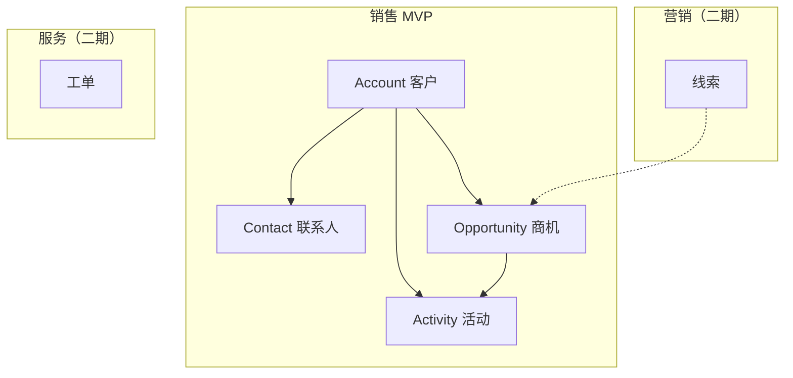
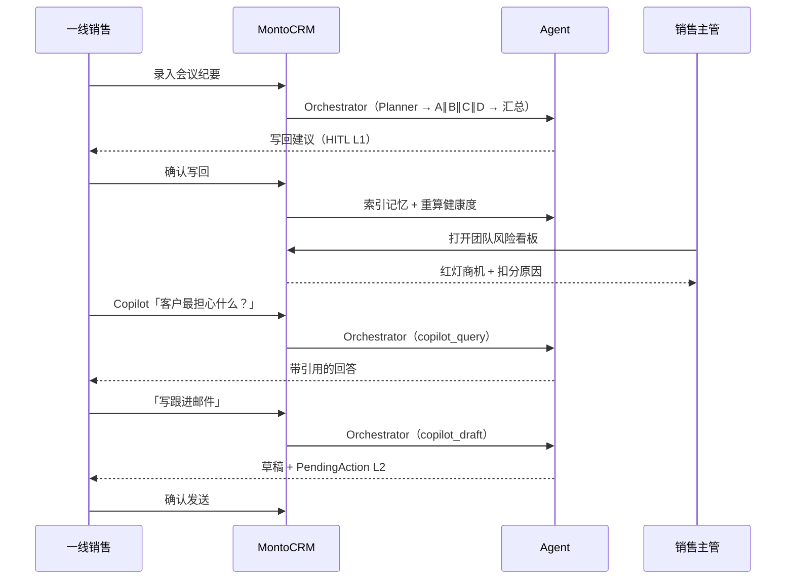
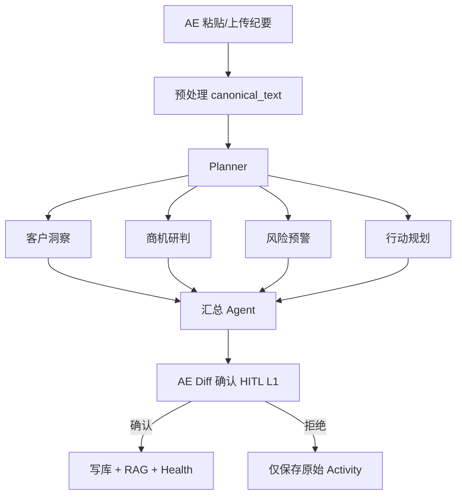
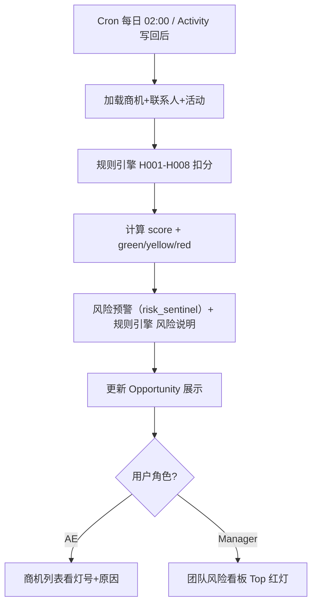
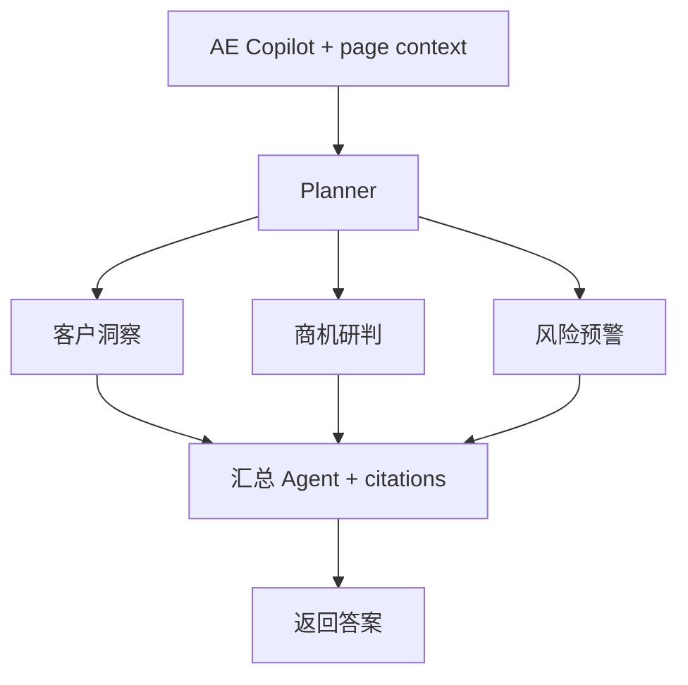
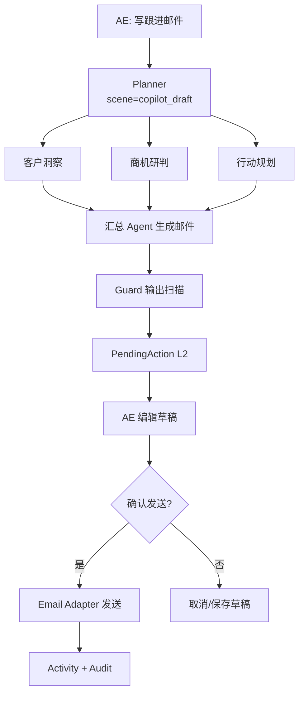
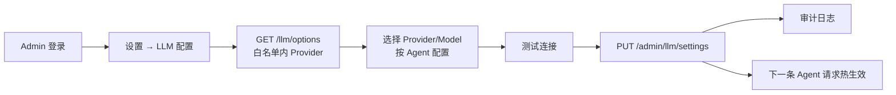
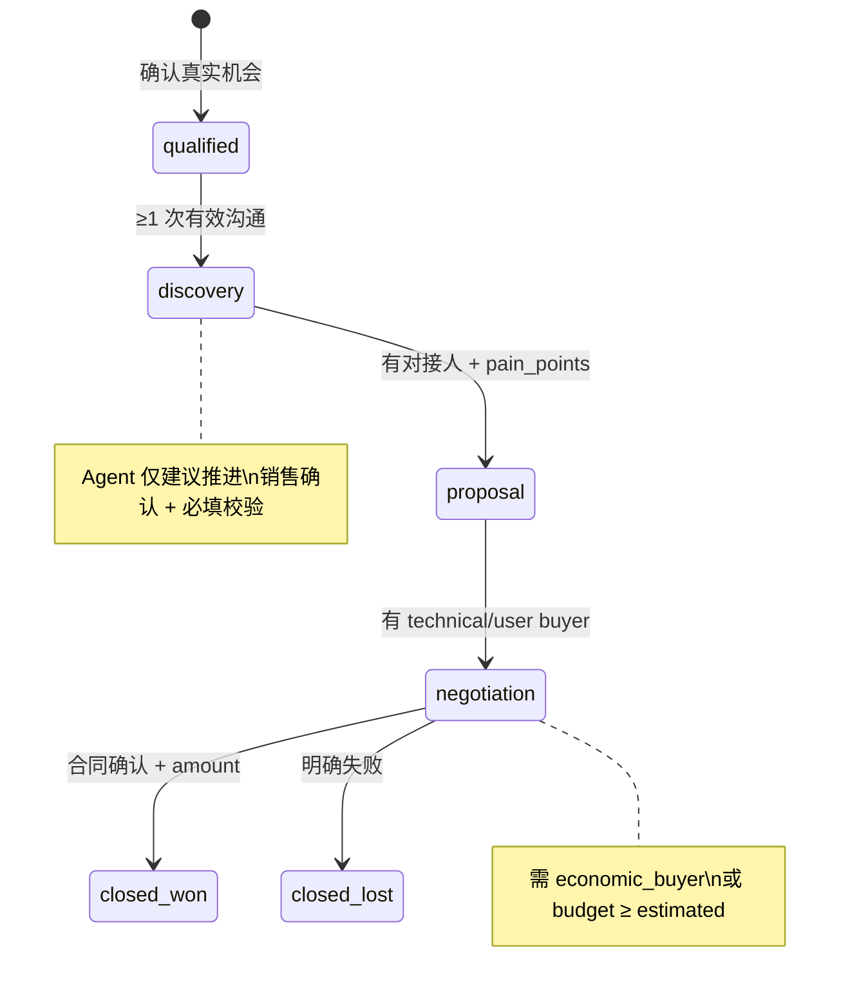

# 业务流程设计

| 属性 | 内容 |
|---|---|
| 版本 | v0.2 |
| 关联 | [PRD §8](../PRD.md) |

---

## 1. 业务域总览

MVP 聚焦 **Sales** 域三条闭环。

---

## 2. 角色协作流程

---

## 3. 闭环 A — 会议纪要 → 智能写回（Orchestrator）

**业务价值**：录入负担 → 说话即录入；Multi-Agent 并行分析 → 汇总写回。

**验收**：见 [P2-checklist](../phases/P2-checklist.md)。

---

## 4. 闭环 B — 商机健康度与风险预警

**两类触发**：① Activity 写回后立即触发单条重算；② Cron 每日凌晨 2 点全量批算（默认，可 Admin 配置间隔）。

**业务规则示例**：

| 规则 | 业务含义 |
|---|---|
| H001/H002 | 单子卡住太久 |
| H003 | 大单缺经济买家 |
| H005 | 有竞对但没应对 |
| H007 | 过了预计成交日还没结 |

**验收**：见 [P3-checklist](../phases/P3-checklist.md)。

---

## 5. 闭环 C — Copilot 查询 + 邮件 + 审批

### 5.1 查询分支（Orchestrator）

简单问句时 Planner **降级为单路**（仍经 Planner，非 API 硬编码）。

### 5.2 邮件分支（Orchestrator）

**业务价值**：Agent 协作 + HITL；零误发邮件。

---

## 6. Admin LLM 配置流程

---

## 7. 商机阶段推进流程（业务规则节点）

---

## 8. 二期场景清单（PRD §5.2）

| 场景 | 说明 |
|---|---|
| 会前简报 | 拜访前自动汇总客户背景 |
| 线索分配 | SDR → AE 评分与路由 |
| 赢单复盘 | 沉淀打法到 Memory/规则 |
| 客成流失预警 | 健康分 + 续费时机 |
| 团队 Pipeline 看板 | 金额分布、阶段漏斗 |

---

## 9. 与 API 契约的对应

| 流程 | 主要 API |
|---|---|
| 闭环 A | `POST /activities/extract`, `POST /writeback/{id}/confirm` |
| 闭环 B | `GET /opportunities?health_status=`, `GET /manager/risk-board` |
| 闭环 C | `POST /copilot/query`, `POST /copilot/draft`, `POST /pending-actions/{id}/confirm` |
| LLM 配置 | `GET/PUT /admin/llm/settings` |

详见 [openapi.yaml](../api/openapi.yaml)。
