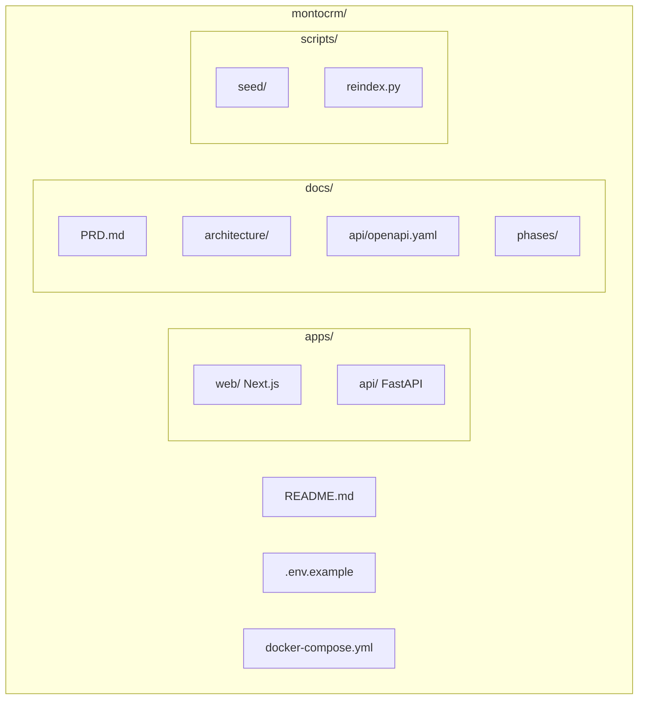
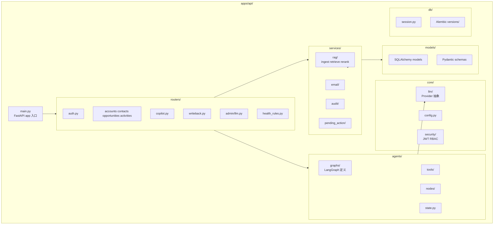
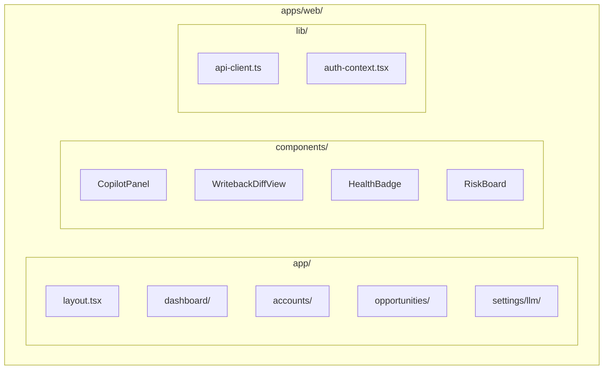

# 代码结构对照（Code Map）

| 属性 | 内容 |
|---|---|
| 版本 | v0.2 |
| 状态 | **规划结构**（P1 创建实际目录） |

> 本文件用于 Review 代码时快速定位模块。P1 完成后需与实际目录保持同步。

---

## 1. Monorepo 总览

---

## 2. 后端 `apps/api/` 结构

---

## 3. 前端 `apps/web/` 结构

---

## 4. 模块 ↔ 文档 ↔ 闭环 对照表

| 目录/模块 | 职责 | 文档 | 闭环 |
|---|---|---|---|
| `agents/graphs/orchestrator.py` | Planner + fan-out/fan-in | agent-architecture §4, §6 | A,C |
| `agents/nodes/planner.py` | 意图与并行路由 | agent-architecture §3 | A,C |
| `agents/nodes/customer_insight.py` | 客户洞察 Agent | agent-architecture §3, §14 | A,C |
| `agents/nodes/opportunity_judge.py` | 商机研判 Agent | agent-architecture §3, §14 | A,C |
| `agents/nodes/risk_sentinel.py` | 风险预警 Agent | agent-architecture §3, §14 | A,B,C |
| `agents/nodes/action_planner.py` | 行动规划 Agent | agent-architecture §3, §14 | A,C |
| `agents/nodes/synthesizer.py` | 汇总 Agent | agent-architecture §3, §14–§15 | A,C |
| `config/planner_rules.yaml` | Planner 路由规则 | agent-architecture §15.1 | A,C |
| `services/rag/` | 混合检索 | rag-pipeline.md | A, C |
| `services/health/` | H001-H008 批算 | PRD §7.2 | B |
| `core/llm/` | Provider 抽象 | tech-architecture §5 | 全部 |
| `routers/admin/llm.py` | Admin LLM 设置 | PRD §10.5.4 | 全部 |
| `services/pending_action/` | HITL 队列 | guardrails-hitl.md | A, C |

---

## 5. 模块 ↔ API 对照

| 模块 | OpenAPI Tag |
|---|---|
| `routers/auth.py` | Auth |
| `routers/opportunities.py` | Opportunities |
| `routers/activities.py` | Activities |
| `routers/writeback.py` | Writeback |
| `routers/copilot.py` | Copilot |
| `routers/admin/llm.py` | Admin LLM |

契约文件：[openapi.yaml](../api/openapi.yaml)

---

## 6. 配置与环境变量

| 文件 | 用途 |
|---|---|
| `.env.example` | 全部环境变量模板（含多 Provider） |
| `apps/api/core/config.py` | Pydantic Settings 加载 |
| `llm_settings` DB 表 | Admin 运行时覆盖 |

---

## 7. Review 检查点

Review 代码时按此顺序：

1. **契约**：改动是否同步 `docs/api/openapi.yaml`？
2. **RBAC**：新路由是否加权限依赖？
3. **HITL**：写操作是否经 PendingAction？
4. **Agent**：新工具是否在 `tools/` 注册并标注级别？
5. **RAG**：写 Activity 是否触发 index？
6. **审计**：L1+ 是否有 audit_log？

---

## 8. P1 完成后更新项

- [ ] 将本节「规划结构」改为实际目录树
- [ ] 补充各模块 README（可选）
- [ ] 链接到 CI 与测试目录
