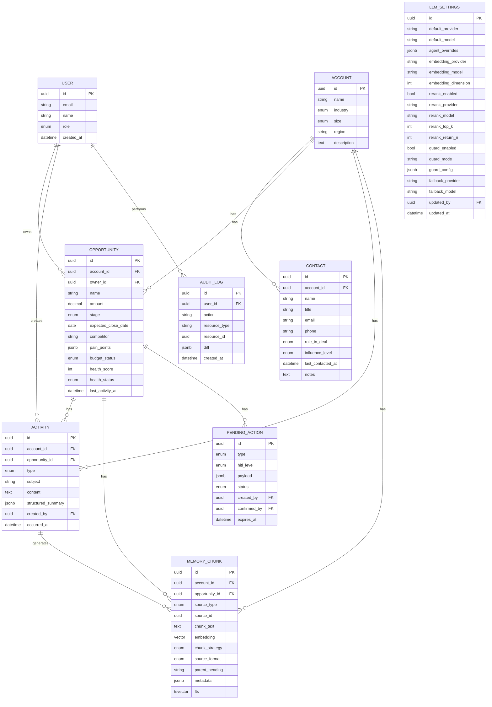
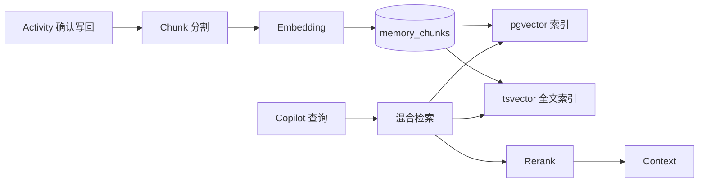

# 数据模型设计

| 属性 | 内容 |
|---|---|
| 版本 | v0.2 |
| 关联 | [PRD §6](../PRD.md) |

---

## 1. ER 图（核心实体）

---

## 2. 枚举定义

### 2.1 opportunity.stage

`qualified` | `discovery` | `proposal` | `negotiation` | `closed_won` | `closed_lost`

### 2.2 contact.role_in_deal

`economic_buyer` | `technical_buyer` | `user_buyer` | `coach` | `influencer` | `unknown`

### 2.3 opportunity.health_status

`green` | `yellow` | `red`

### 2.4 activity.type

`meeting` | `call` | `email` | `note` | `agent_action`

### 2.5 pending_action.status

`pending` | `confirmed` | `rejected` | `expired`

---

## 3. Memory 与业务表关系

**原则**：

- 结构化字段写回 `opportunities` / `contacts`
- 原始与摘要进 `activities.structured_summary`
- 可检索文本进 `memory_chunks`
- 禁止只更新 Memory 不更新业务表

---

## 4. LangGraph Checkpoint 表（概要）

| 表 | 用途 |
|---|---|
| `checkpoints` | LangGraph 官方 PostgresSaver 表 |
| `checkpoint_writes` | 写入记录 |

与 `thread_id` 关联，支持 HITL interrupt/resume。

---

## 5. 索引策略（MVP）

| 表 | 索引 |
|---|---|
| opportunities | `(owner_id, stage)`, `(health_status, amount DESC)` |
| activities | `(account_id, occurred_at DESC)`, `(opportunity_id)` |
| memory_chunks | `ivfflat (embedding vector_cosine_ops)`, `GIN (fts)` |
| pending_actions | `(status, created_by)`, `(expires_at)` |

---

## 6. 种子数据规格

见 [PRD §11](../PRD.md)。种子脚本路径（P2）：`scripts/seed/`.

---

## 7. 迁移策略

- Alembic 管理所有 DDL
- pgvector extension 在首次 migration 启用
- 变更 embedding 维度需 re-index 脚本

---

## 8. 数据隔离

| 级别 | MVP |
|---|---|
| 租户 | 单租户 |
| 用户 | AE 仅看本人 owner 商机；Manager 看团队；Admin 全部 |
| Agent | 工具层强制 RBAC filter |
