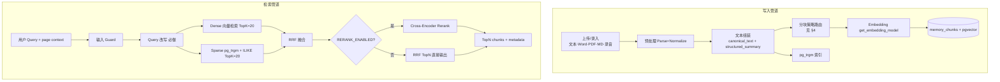
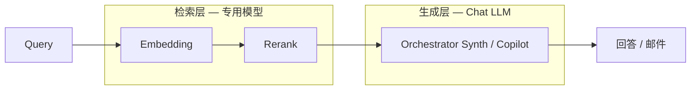
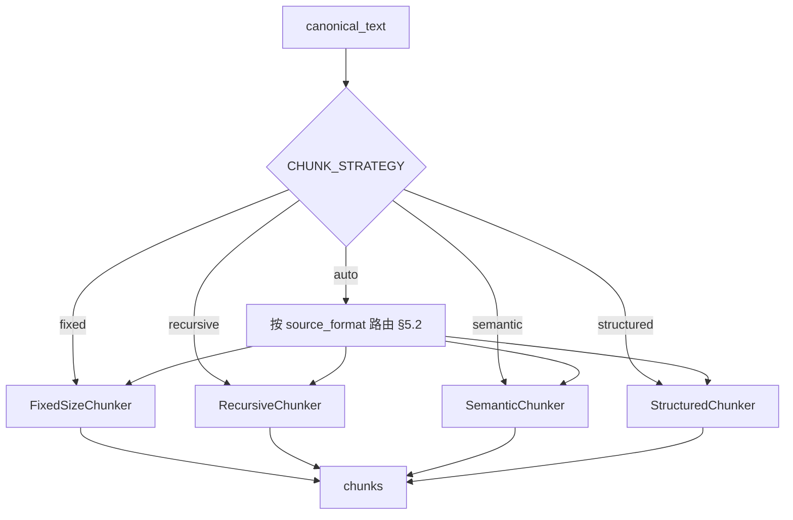
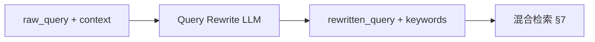
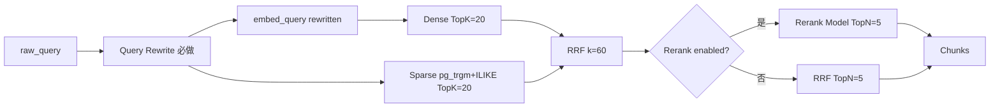
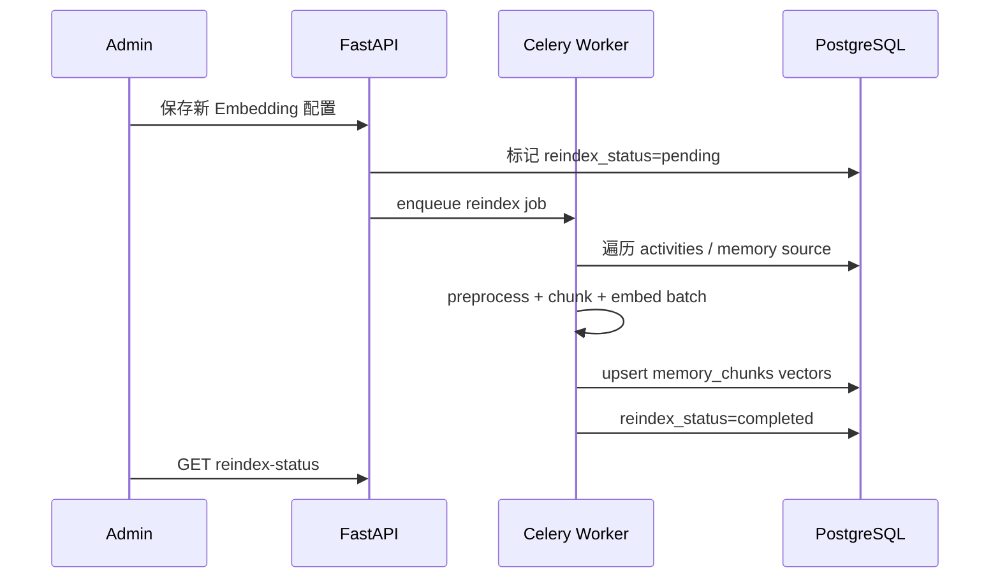

# RAG 管道设计

| 属性 | 内容 |
|---|---|
| 版本 | v0.4 |
| 关联 | [PRD §9.3 / §10.5.5](../PRD.md)、[data-model.md](data-model.md)、[P7-checklist.md](../phases/P7-checklist.md) |

---

## 1. 管道总览



**MVP 不做 GraphRAG**；决策链关系走 PostgreSQL 结构化查询 + 规则引擎。

**关键约束**：

1. **先预处理、再组装、再分块** — 禁止对原始二进制或未清洗文本直接 chunk。  
2. **Query 改写必做** — 检索前必须经过改写节点（不是可选优化）。  
3. 分块策略 **按内容类型自动选择**，Admin 可配置默认与 override（§4）。

---

## 2. 专用模型与 Chat LLM 的关系

RAG 使用 **两类独立模型**，均 **不得** 与 Orchestrator 专责 Agent（Planner/A/B/C/D/Synth）的 Chat 模型混配：

| 模型 | 调用时机 | 配置入口 | 变更影响 |
|---|---|---|---|
| **Embedding** | 写入索引 + 查询向量化 | Admin「检索模型」Tab / `.env` | **需 re-index** |
| **Rerank** | 查询管道 RRF 之后 | Admin「检索模型」Tab / `.env` | 即时生效 |

Chat LLM 仅在检索完成后，由 **Orchestrator 汇总 Agent**（或 Copilot 润色节点）使用检索结果 **生成** 回答或邮件。



---

## 3. 模型配置（与 Chat 对齐）

### 3.1 配置优先级

```text
DB llm_settings（Admin 保存）> .env 默认值
```

API Key 仅在 `.env`；Admin API **never** 读写 Key。

### 3.2 Embedding

| 配置项 | 说明 | 示例 |
|---|---|---|
| `EMBEDDING_AVAILABLE_PROVIDERS` | 白名单 | `local,openai,dashscope` |
| `EMBEDDING_PROVIDER` | 默认 Provider | `local`（hash）或 `sidecar` |
| `EMBEDDING_MODEL` | 模型 | `BAAI/bge-m3` |
| `EMBEDDING_DIMENSION` | pgvector 维度 | **1024**（本地 bge-m3） |
| `HF_SIDECAR_URL` | 本机 HF 服务 | `http://127.0.0.1:18090` |

**抽象接口**：`embed_texts(texts) -> list[list[float]]`（`apps/api/app/services/rag/embedder.py`）

- `embed_texts` — ingest 批量与查询向量化

**Provider 类型（P7 + sidecar）**：

| Provider | 实现 |
|---|---|
| `local` / `mock` / `hash` | 确定性 ngram hash（**API 不加载 torch**） |
| `sidecar` / `hf` | HTTP 调 `apps/hf-sidecar`（sentence-transformers 加载缓存里的 `BAAI/bge-m3`） |
| `openai` | OpenAI 兼容 embedding API |
| `dashscope` | 通义 embedding |

sidecar 不可达时 **降级 hash**，不 500。启用 sidecar 后必须 `alembic upgrade head`（列宽 1024）并 `python scripts/reindex.py --full`。

启动 sidecar（Windows）：`powershell -File scripts/run_hf_sidecar.ps1`（`HF_HOME=D:\huggingface_cache`）。

### 3.3 Rerank

| 配置项 | 说明 | 示例 |
|---|---|---|
| `RERANK_ENABLED` | 总开关 | `true` |
| `RERANK_AVAILABLE_PROVIDERS` | 白名单 | `local,cohere` |
| `RERANK_PROVIDER` | Provider | `local` / `sidecar` / `dashscope` |
| `RERANK_MODEL` | 模型 | `BAAI/bge-reranker-v2-m3` |
| `RERANK_TOP_K` | RRF 后参与 rerank 数 | `20` |
| `RERANK_RETURN_N` | 输出给 LLM 的条数 | `5` |

**抽象接口**：`rerank_docs(query, docs, return_n)`（`apps/api/app/services/rag/rerank.py`）

**降级**：`RERANK_ENABLED=false` → RRF TopN。`sidecar`/`dashscope` 失败 → **lexical**；再失败 → 原 RRF 顺序，**不 500**。torch 只运行在 sidecar，不进 `docker/api` 镜像。

### 3.4 Admin 设置页（检索模型 Tab）

| 操作 | 行为 |
|---|---|
| 修改 Embedding | 弹窗确认 → 保存 → 触发/排队 re-index |
| 修改 Rerank | 保存即热生效 |
| 检索测试 | `POST /admin/rag/test-retrieval` 返回 chunks，不调用 Chat |
| 查看 re-index 进度 | `GET /admin/rag/reindex-status` |

---

## 4. 写入预处理（Parse + Normalize）

> **时机**：在 **文本组装与分块之前**，对上传物或粘贴内容统一走预处理流水线。  
> Orchestrator（Planner + 专责 Agent）可读 `canonical_text`；RAG 索引 **只使用预处理后的 canonical 文本**。

### 4.1 支持的输入类型

| 类型 | 扩展名/MIME | MVP | 预处理动作 |
|---|---|---|---|
| 纯文本 | `.txt` | ✅ | 编码检测 → UTF-8 → 规范化空白 |
| Markdown | `.md` | ✅ | 保留标题结构；剥离 frontmatter（可选） |
| Word | `.docx` | ✅ | python-docx / mammoth → 纯文本 + 标题层级 |
| PDF | `.pdf` | ✅ 基础 | pdfplumber/pymupdf 抽文本；扫描件 OCR 二期 |
| 录音 | `.mp3` `.wav` `.m4a` | 分期 | ASR 转写 → 文本；MVP 可接 Whisper/API，未配置则拒绝 |
| 粘贴 | 表单 textarea | ✅ | 同纯文本 |

闭环 A 流程：`上传/粘贴 → 预处理 → Orchestrator（A∥B∥C∥D → 汇总）→ 人确认写回 → **对 canonical_text 分块索引**`。

### 4.2 预处理流水线


**Normalize 清洗（统一规则）**：

- 统一 UTF-8；去除 BOM、控制字符  
- 合并连续空行；全角/半角标点可选规范化  
- 去除页眉页脚模式（PDF/Word 常见重复行）  
- 录音转写：填充词可选压缩（「嗯」「那个」→ 可配置）  
- 记录 `preprocess_warnings`（空页、乱码段、低 ASR 置信度）

**输出结构**（写入 Activity 或索引任务 payload）：

```json
{
  "canonical_text": "清洗后的全文",
  "source_format": "docx",
  "structure_hints": { "headings": ["## 会议背景", "## 客户顾虑"] },
  "preprocess_warnings": [],
  "structured_summary": { }
}
```

### 4.3 解析器抽象

| 接口 | 说明 |
|---|---|
| `detect_content_type(file \| text)` | 返回 mime + 推荐分块策略 |
| `parse_to_canonical(raw) -> CanonicalDocument` | 各格式解析 |
| `normalize(canonical) -> canonical` | 统一清洗 |

实现目录（P2）：`apps/api/services/rag/preprocess/`

---

## 5. 分块策略（Chunk Strategy）

分块在 **`canonical_text` 组装完成后** 执行。支持四种策略，**按内容类型自动路由**，Admin 可配默认策略。

### 5.1 四种策略说明

| 策略 | 代码 | 做法 | 适用 |
|---|---|---|---|
| **固定长度** | `fixed` | 按字符数或 token 数硬切，带 overlap | 转写稿、格式混乱文本 |
| **递归** | `recursive` | 段落 → 句子 → 字符 逐级尝试 separator 切分 | **默认**；通用纪要 |
| **语义** | `semantic` | 按 embedding 相邻句相似度找断点再合并为 chunk | 长文、话题切换多 |
| **结构化** | `structured` | 按 Markdown `#` 标题 / HTML 标签 / Word 大纲层级切 | `.md`、带标题 Word |

**固定长度**：`chunk_size=512` tokens，`overlap=64`（可配置）。  
**递归**：LangChain `RecursiveCharacterTextSplitter`，separators `["\n\n","\n","。"," ",""]`。  
**语义**：对句子 embedding → 相似度低于阈值处切分 → 合并到 `chunk_size` 上限；计算成本高于递归。  
**结构化**：先按 H1/H2/H3 切段，段内超长再 **递归** 二次切。

### 5.2 自动路由规则（默认）

| 输入 | 首选策略 | 段内超长 fallback |
|---|---|---|
| `.md` / 检测到 Markdown 标题 | `structured` | `recursive` |
| `.docx` 带 heading 样式 | `structured` | `recursive` |
| `.pdf` / `.txt` / 粘贴纯文本 | `recursive` | `fixed` |
| ASR 转写（录音） | `recursive` | `fixed` |
| Admin 强制指定 | `CHUNK_STRATEGY` env | — |

每条 `memory_chunk` 记录 `chunk_strategy` 与 `parent_heading`（若有）到 metadata。

### 5.3 配置项

| 配置项 | 说明 | 默认 |
|---|---|---|
| `CHUNK_STRATEGY` | `fixed` / `recursive` / `semantic` / `structured` / `auto` | `auto` |
| `CHUNK_SIZE` | token 或字符上限 | `512` tokens |
| `CHUNK_OVERLAP` | overlap | `64` tokens |
| `SEMANTIC_CHUNK_THRESHOLD` | 语义断点相似度阈值 | `0.5`（仅 semantic） |
| `CHUNK_SIZE_MEASURE` | `token` / `char` | `token` |

Admin「检索模型」Tab 可配置上述项；变更 **不** 触发 re-index（与 Embedding 不同），但变更后 **新写入** 用新策略；可选「按新策略重建索引」任务。



---

## 6. Query 改写（必做）

> **产品要求**：每一次 `search_memory` / Copilot 检索 **必须先经过 Query 改写**，再进入混合检索。禁止跳过。

### 6.1 为什么必做

- 口语化问题与纪要书面用语 **gap** 大（「交付担心」vs「实施周期风险」）  
- 多轮 Copilot 需要 **指代消解**（「他」「这个单子」→ 绑定 Contact/Opp）  
- 提升 sparse（关键词）与 dense（语义） **双路召回率**

### 6.2 改写输入

| 输入 | 来源 |
|---|---|
| `raw_query` | 用户原问 |
| `page_context` | account_id, opportunity_id, 当前客户名 |
| `chat_history` | 最近 N 轮（checkpoint，可选） |
| `structured_hints` | 商机阶段、竞对、关键 Contact 名 |

### 6.3 改写输出

```json
{
  "rewritten_query": "华为 MES 项目 客户对交付周期和实施风险的顾虑",
  "keywords": ["交付周期", "实施风险", "华为"],
  "hyde_passage": null,
  "skip_retrieval": false
}
```

| 字段 | 说明 |
|---|---|
| `rewritten_query` | 用于 **dense** embedding 检索 |
| `keywords` | 用于 **sparse** tsquery 增强（可选） |
| `hyde_passage` | 可选 HyDE 假想段落，仅 dense 一路 |
| `skip_retrieval` | 若为 true（如纯寒暄），直接走 LLM 不检索 |

### 6.4 实现方式（P7 已实装）

- `search_memory` **始终**先调用 `rewrite_query`（`apps/api/app/services/rag/retriever.py`）
- 有 Chat Key 时走 Planner 级轻量模型，超时 `RAG_REWRITE_TIMEOUT_SEC`（默认 3s）
- 无 Key / 超时 / 非文本输出：`rewritten_query = 清洗后的 raw_query`（改写节点仍执行）
- Query Expansion：`RAG_EXPAND_ENABLED=true` 时最多再搜 2 个同义短语，默认关
- 审计：warning 日志 `query_rewrite_fallback`



### 6.5 验收

- [x] `search_memory` 代码路径无「绕过改写」分支（仅允许失败降级）
- [x] Admin `POST /admin/rag/test-retrieval` 返回 `rewritten_query`
- [ ] 多轮 Copilot「他」类指代（可选增强；当前改写保留关键词，无多轮指代消解）

---

## 7. 混合检索 + Rerank 详解



| 阶段 | 实现 | 专用模型 |
|---|---|---|
| Dense | pgvector cosine | **Embedding**（Dashscope BGE 或 local hash） |
| Sparse | `pg_trgm` `similarity` + `ILIKE`（中文客户名/型号） | — |
| RRF | Reciprocal Rank Fusion，`RAG_RRF_K` / 权重可配 | — |
| Rerank | Dashscope `gte-rerank` 或 lexical；top-20 → top-5 | **Rerank** |

配置：`RAG_RRF_K`（默认 60）、`RAG_VECTOR_WEIGHT`、`RAG_KEYWORD_WEIGHT`。

---

## 8. Re-index 流程

Embedding 模型或维度变更后 **必须** re-index：



CLI：`python scripts/reindex.py --full`（仓库根）或 `cd apps/api && python -m app.services.rag.reindex --full`

Admin：`GET /admin/rag/reindex-status`、`POST /admin/rag/reindex`、`POST /admin/rag/test-retrieval`。

修改 Embedding 模型/维度后 `PUT /admin/llm/settings` 会置 `needs_reindex=true`。

**实测口径**：local/hash 路径 1000 chunks 远小于 5 分钟（无远程 API）。Dashscope 取决于 QPS。

---

## 9. 过滤与权限

检索必须带 filter：

```python
filters = {
    "account_id": page_context.account_id,
    "owner_id": current_user.id,  # RBAC
}
```

Manager/Admin 按角色放宽 filter。

---

## 10. 引用（Citation）

返回格式：

```json
{
  "answer": "...",
  "citations": [
    {
      "chunk_id": "uuid",
      "activity_id": "uuid",
      "snippet": "...",
      "occurred_at": "2026-06-01"
    }
  ],
  "retrieval_meta": {
    "raw_query": "客户最担心什么",
    "rewritten_query": "华为 MES 项目 交付周期 实施风险",
    "chunk_strategy": "recursive",
    "embedding_provider": "local",
    "embedding_model": "BAAI/bge-m3",
    "rerank_enabled": true,
    "rerank_provider": "sidecar",
    "rerank_model": "BAAI/bge-reranker-v2-m3"
  }
}
```

汇总 Agent（`copilot_query`）prompt 要求：无 citation 则声明未找到。

---

## 11. 与 LLM Guard 的衔接

```text
用户 raw_query → Guard 输入扫描 → Query 改写（必做）→ 混合检索 → Orchestrator（A∥B∥C → Synth）→ Guard 输出扫描 → 返回
```

Guard 在改写 **之前**（拦截恶意输入）；改写使用独立 LLM 调用，不计入「可选 Chat」路径。

---

## 12. 评测（分期）

| 阶段 | 方法 |
|---|---|
| P6+ | `make eval`：启发式 Faithfulness / Relevancy / Context Recall + **检索 MRR@5**（相对 P4 随机向量基线） |
| 可选 | `RAGAS_BACKEND=llm` 安装 ragas 后走 LLM 评测 |

---

## 13. 性能目标

| 指标 | MVP |
|---|---|
| 检索 P95（含改写 + Rerank） | 无 Key 内存混合检索 ≤ 500ms；含远程改写/Rerank 以 Key 延迟为准，目标 ≤ 4s |
| Query 改写 P95 | 超时上限 `RAG_REWRITE_TIMEOUT_SEC=3` |
| 预处理 + 索引单条 Activity | 异步 ≤ 45s（含 docx/pdf） |
| 全库 re-index（120 Activity） | ≤ 10 min（本地 bge-small） |

---

## 14. 与 Agent 的关系

RAG 作为 **Tool** `search_memory`，由 Orchestrator 专责 Agent（A/B/C/D）经 Tool Registry 调用。

`search_memory` 内部调用链（**不可省略改写**）：

```text
build_retrieval_context(page_context, history)
  → rewrite_query(raw_query, context)          # 必做
  → embed_query(rewritten_query)
  → hybrid_search(dense + sparse + RRF)
  → rerank (if enabled)
  → return documents + retrieval_meta
```

Orchestrator 上传路径在调用 Planner **之前**走 `parse_to_canonical()`（§4）。

详见 [agent-architecture.md](agent-architecture.md) §14–§15。

---

## 15. MVP 默认推荐

| 组件 | 推荐 |
|---|---|
| 预处理 | txt/md/docx ✅；pdf 基础 ✅；录音 ASR 按需 |
| 分块 | `CHUNK_STRATEGY=auto`（md→structured，其余→recursive） |
| Query 改写 | **必做**；模型可用 `LLM_QUERY_*` 或独立 `LLM_REWRITE_*` |
| Embedding | `local` hash（无 Key）或 `dashscope` BGE-M3 |
| Rerank | `local` lexical 或 `dashscope` `gte-rerank` |
| Chat（Synth / Copilot 生成） | Admin 自选 DeepSeek / 通义等 |
