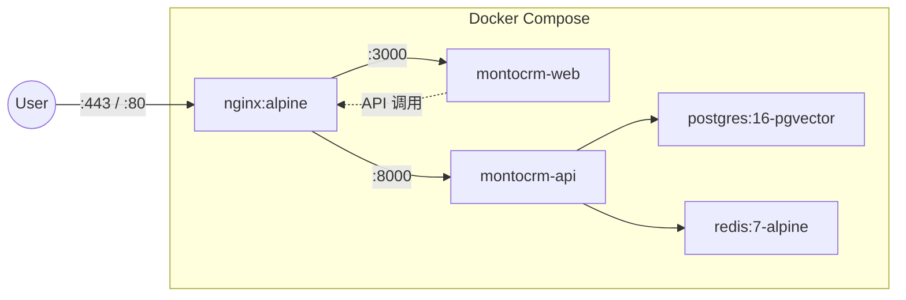
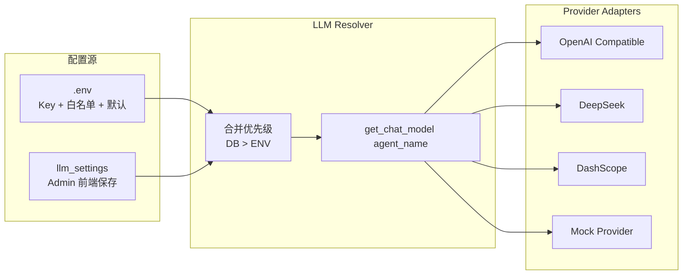
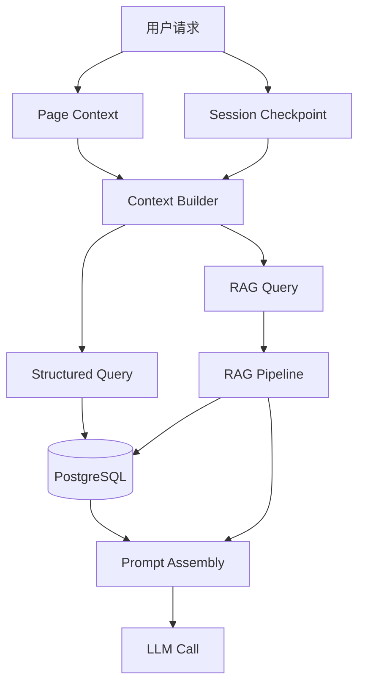

# 技术架构设计

| 属性 | 内容 |
|---|---|
| 版本 | v0.2 |
| 关联 | [PRD §10](../PRD.md)、[agent-architecture.md](agent-architecture.md) |

---

## 1. 架构原则

1. **单体优先、边界清晰**：MVP 采用 monorepo + 模块化，不过早微服务化。
2. **配置驱动 LLM**：Provider/Model 通过 `.env` 白名单 + Admin DB 配置，业务代码不绑厂商。
3. **Agent 与 API 分离**：FastAPI 负责 HTTP/权限；LangGraph 负责 Agent 状态与编排。
4. **结构化 + 语义双轨存储**：业务表在 PostgreSQL；RAG 用 pgvector + tsvector。
5. **可观测分期落地**：MVP 结构化日志 + 健康检查；Langfuse/Prometheus 二期加深。

---

## 2. 系统技术架构图

```mermaid
flowchart TB
    subgraph Client["客户端"]
        Browser[Browser]
    end

    subgraph Edge["边缘层"]
        NGINX[Nginx<br/>反向代理 / TLS / 静态资源]
    end

    subgraph App["应用层"]
        WEB[Next.js 15<br/>App Router]
        API[FastAPI<br/>REST + SSE]
    end

    subgraph AgentLayer["Agent 层 — Orchestrator"]
        LG[LangGraph orchestrator.py<br/>Planner → A∥B∥C∥D → Synth]
        TOOLS[Tool Registry<br/>CRM / RAG / Email]
        CTX[Context Builder<br/>page context + memory]
    end

    subgraph LLMLayer["LLM 层"]
        LP[LLM Provider 抽象层]
        P1[OpenAI 兼容]
        P2[DeepSeek]
        P3[DashScope / 其他]
        EMB[Embedding Provider]
    end

    subgraph DataLayer["数据层"]
        PG[(PostgreSQL 16<br/>业务表 + pgvector)]
        REDIS[(Redis 7<br/>缓存 / 会话 / 任务队列)]
    end

    subgraph Obs["可观测 MVP"]
        LOG[结构化 JSON 日志]
        HC[/health /metrics]
    end

    Browser --> NGINX
    NGINX --> WEB
    NGINX --> API
    WEB --> API
    API --> LG
    LG --> TOOLS
    LG --> CTX
    LG --> LP
    LP --> P1
    LP --> P2
    LP --> P3
    TOOLS --> PG
    CTX --> PG
    CTX --> REDIS
    EMB --> PG
    API --> REDIS
    API --> LOG
    API --> HC
```

---

## 3. 部署架构图



**二期可选容器**：Langfuse、Prometheus、Grafana、RabbitMQ、MailHog。

---

## 4. 技术选型明细

| 类别 | MVP | 二期 | 说明 |
|---|---|---|---|
| 前端 | Next.js 15 + TS + Tailwind | shadcn/ui 组件库 | App Router，Admin 设置页 |
| 后端 | FastAPI + Uvicorn | — | 异步 API，OpenAPI 自动生成 |
| Agent | LangGraph + LangChain | MCP Tool Server | 状态持久化 checkpoint → Postgres |
| ORM | SQLAlchemy 2.0 async | — | Alembic 迁移 |
| 主库 | PostgreSQL 16 + pgvector | — | 不单独引入 Qdrant（MVP） |
| 缓存 | Redis | — | 会话、限流、短缓存、Celery broker |
| 消息队列 | Redis + Celery（或 ARQ） | RabbitMQ | MVP 够用；高吞吐再换 MQ |
| 反向代理 | Nginx | — | TLS、路由、静态资源 |
| RAG | 混合检索 + Rerank | GraphRAG 评估 | MVP 不用 GraphRAG |
| 向量 | pgvector | — | 与业务同库，运维简单 |
| LLM | Provider 抽象 + Admin 切换 | Langfuse cost | 见 [PRD §10.5](../PRD.md) |
| 安全 | RBAC + HITL + 规则引擎 | LLM Guard | [guardrails-hitl.md](../security/guardrails-hitl.md) |
| 评测 | 人工抽检 | Langfuse + Ragas | — |
| 监控 | /health + JSON 日志 | Prometheus + Grafana | MVP 暴露 metrics 端点预留 |
| 集成 | Python Tools | MCP | 二期标准化 |
| 部署 | Docker Compose | K8s 可选 | — |

---

## 5. LLM Provider 抽象层



**配置优先级**：`llm_settings`（DB）> `.env` 默认值。

**关键约束**：

- API Key 仅存在于服务端环境变量
- Admin API/前端 never 返回 Key
- 每个 Agent 独立解析 provider/model
- Embedding 与 Chat 分开配置

---

## 6. 上下文工程（Context Engineering）

| 上下文类型 | 来源 | 用途 |
|---|---|---|
| Page Context | 前端传入 `account_id` / `opportunity_id` | Copilot 消歧 |
| Session Context | JWT + 最近对话 checkpoint | 多轮对话 |
| Structured Context | PostgreSQL 业务表 | 阶段、金额、决策链 |
| Semantic Context | RAG 检索 Memory Chunk | 历史纪要、顾虑、承诺 |
| Procedural Context | 业务规则 JSON（阶段必填项、HITL 级别） | Agent 决策边界 |



---

## 7. 状态持久化

| 状态类型 | 存储 | 说明 |
|---|---|---|
| LangGraph Checkpoint | PostgreSQL `checkpoints` | 对话/Agent 图状态，支持 interrupt 恢复 |
| 业务数据 | PostgreSQL 业务表 | Account/Opportunity 等 |
| PendingAction | PostgreSQL | HITL 待确认队列 |
| LLM Settings | PostgreSQL `llm_settings` | Admin 配置 |
| 热缓存 | Redis | 检索结果、rate limit |

---

## 8. 工具编排

MVP 使用 Python Tool Registry（函数注册），接口形态预留 MCP：

| Tool | 级别 | 说明 |
|---|---|---|
| `get_account` / `get_opportunity` | L0 | 读 CRM |
| `search_memory` | L0 | RAG 检索（Orchestrator 专责 Agent 共用） |
| `build_writeback_proposal` | L1 | Synth 生成写回建议（原 Writeback） |
| `apply_writeback` | L1 | HITL confirm 后写入 |
| `run_health_rules` | L0 | H001–H008 规则批算 |
| `create_pending_action` | L1/L2 | HITL 队列 |
| `send_email` | L2 | 需确认后执行 |

---

## 9. 可观测性分期

```mermaid
flowchart LR
    subgraph MVP["MVP"]
        L1[结构化日志]
        L2[request_id / agent_name / provider / model]
        L3[/health /ready /metrics stub]
    end

    subgraph Phase2["二期"]
        LF[Langfuse Traces]
        RG[Ragas Eval Gate]
        PM[Prometheus + Grafana]
    end

    MVP --> Phase2
```

---

## 10. 与 PRD 的映射

| PRD 章节 | 本文档章节 |
|---|---|
| §5 MVP 范围 | §4 选型、§8 工具 |
| §10.5 LLM 切换 | §5 |
| §9 Agent | [agent-architecture.md](agent-architecture.md) |
| §6 数据模型 | [data-model.md](data-model.md) |
| §8 业务闭环 | [business-flow.md](business-flow.md) |

---

## 11. 开放决策（P1 前确认）

- [ ] Celery vs ARQ vs 纯 Redis 队列
- [ ] Cross-Encoder Rerank：本地模型 vs API
- [ ] 默认 Embedding 模型选型
