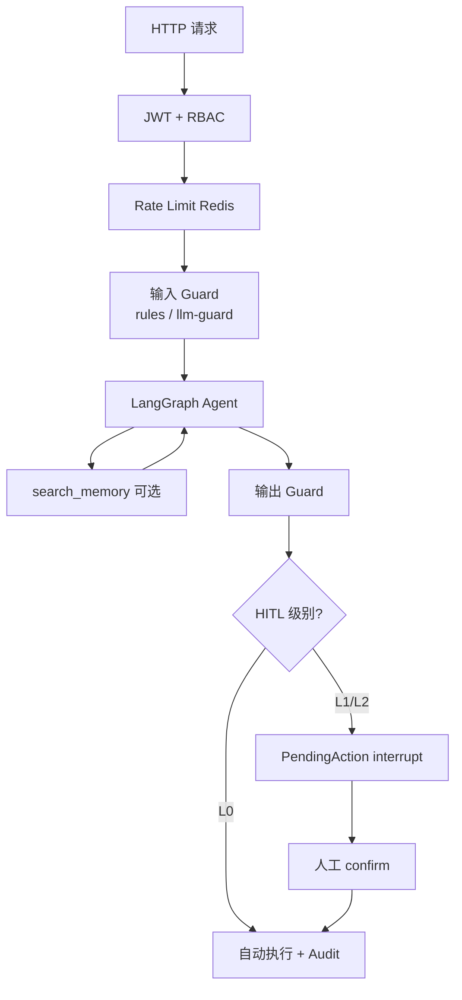
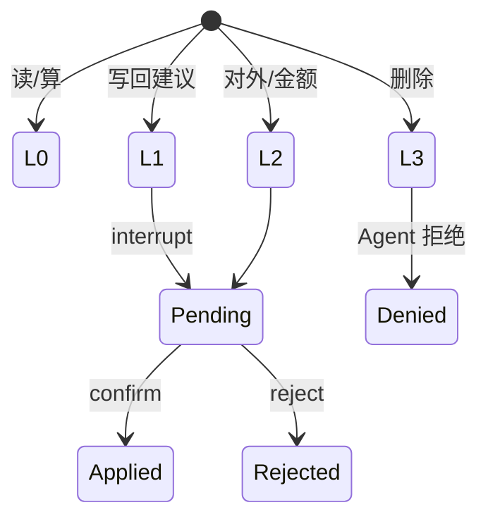
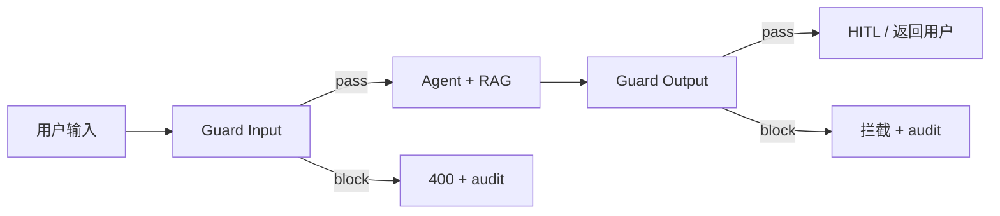
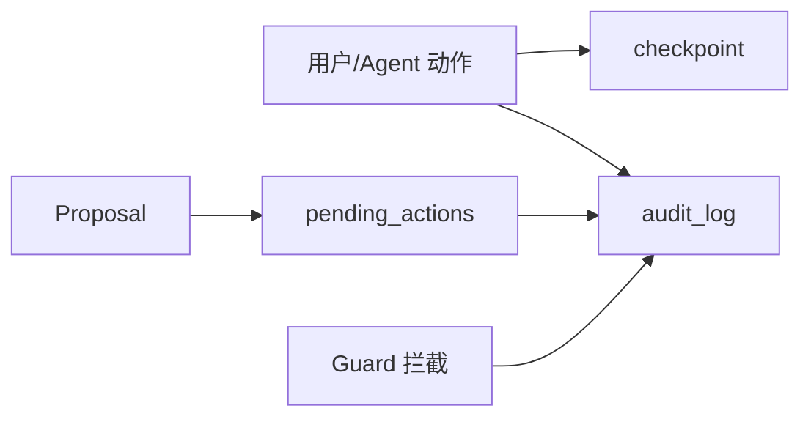

# 安全护栏与 HITL 设计

| 属性 | 内容 |
|---|---|
| 版本 | v0.3 |
| 关联 | [PRD §7.3](../PRD.md)、[PRD §10.5.5](../PRD.md)、[agent-architecture.md](../architecture/agent-architecture.md) |

---

## 1. 安全分层



---

## 2. RBAC 权限隔离

| 资源 | AE | Manager | Admin |
|---|---|---|---|
| 本人商机 | R/W | R | R/W |
| 团队商机 | — | R | R/W |
| 全部商机 | — | — | R/W |
| 模型配置（Chat/RAG/Guard） | — | — | R/W |
| 审计日志 | — | R | R/W |
| Agent 工具 | 按 owner 过滤 | 团队过滤 | 无 filter |

**实现要点**：

- 所有 CRM 查询带 `owner_id` / 团队 filter
- Agent Tool 层强制 filter，不依赖 prompt 自觉
- Admin API 独立 router + `require_role(admin)`

---

## 3. HITL 分级（L0–L3）

| 级别 | 动作 | 行为 |
|---|---|---|
| **L0** | 检索、内部摘要、健康度计算 | 自动 + audit |
| **L1** | 写回字段、新建 Contact、建议阶段 | PendingAction → AE confirm |
| **L2** | 发邮件、推进 negotiation+、改 amount | AE confirm；amount 需 Manager |
| **L3** | 删除、覆盖 closed | 禁止 Agent |



---

## 4. LLM Guard 与专用配置

> **LLM Guard 不是 Chat 模型**。与 Embedding/Rerank 一样，在 Admin **「安全护栏」Tab** 单独配置，**不得**出现在 Planner/专责/Synth 的 Chat 模型下拉里。

### 4.1 Guard 是什么

| 模式 | 第一期 MVP | 第二期 P5 |
|---|---|---|
| **rules** | 规则引擎（长度、正则、关键词） | 保留；可单独选用 |
| **hybrid（默认）** | — | 规则/启发式评分 + 可选 `GUARD_API_URL` 分类器；分类器不可用则降级规则 |
| **llm-guard** | — | 优先远程 `/scan`；失败降级规则 |

Guard **不**占用 Chat 模型下拉。PII 使用内置中文 NER（手机/身份证校验/邮箱/带称谓姓名），不强制安装 Presidio/torch。

### 4.2 配置项

| 配置项 | P5 | 说明 |
|---|---|---|
| `GUARD_ENABLED` | ✅ | 总开关 |
| `GUARD_MODE` | `hybrid` | `rules` / `hybrid` / `llm-guard` |
| `GUARD_SENSITIVITY` | ✅ | 0–1，默认 `0.85`；Admin 可写入 `guard_config.sensitivity` |
| `GUARD_MAX_INPUT_CHARS` | ✅ | 默认 `10000` |
| `GUARD_MAX_OUTPUT_CHARS` | ✅ | 默认 `8000` |
| `GUARD_API_URL` | 可选 | 远程分类器；空则规则降级 |
| `pii_redact_input` | ✅ | 默认 false（纪要需保留姓名） |
| `pii_redact_output` | ✅ | 默认 true |

**DB 字段**（`llm_settings.guard_config` JSON）：

```json
{
  "sensitivity": 0.85,
  "pii_redact_input": false,
  "pii_redact_output": true,
  "max_input_chars": 10000,
  "max_output_chars": 8000
}
```

拦截：`audit_log.action = guard.block`（snippet 已脱敏）；Prometheus `montocrm_guard_blocked_total{reason}`。

Admin：`POST /admin/llm/guard/test` 扫样例。

### 4.3 扫描挂载点

| 位置 | 扫描方向 | 失败行为 |
|---|---|---|
| Copilot 用户问题 | 输入 | 400 + 审计；不进入 RAG/Agent |
| 纪要粘贴 `extract` | 输入 | 400；不调用 Orchestrator |
| Agent 草稿邮件 | 输出 | 不创建 PendingAction；提示修改 |
| PendingAction confirm 前 | 输出 | 阻止 send_email |
| Chat 回复（可选 MVP） | 输出 | 替换为安全提示或拒答 |



### 4.4 Admin 安全护栏 Tab

| 能力 | MVP | 二期 |
|---|---|---|
| 开关 `GUARD_ENABLED` | ✅ | ✅ |
| 查看 / 选择 mode | ✅ 只读 `rules` | `rules` / `hybrid` / `llm-guard` |
| 灵敏度 0–1 | ❌ | ✅ `guard_config.sensitivity` |
| 测试输入样例 | ✅ | ✅ `POST /admin/llm/guard/test` |
| Guard 拦截统计 | 日志 | Prometheus `guard_blocked_total` + audit |

### 4.5 与 Chat / Embedding / Rerank 配置对照

| 配置域 | Admin Tab | 抽象层入口 | Key 存放 |
|---|---|---|---|
| Chat LLM | 对话模型 | `get_chat_model(agent)` | `.env` |
| Embedding | 检索模型 | `get_embedding_model()` | `.env` |
| Rerank | 检索模型 | `rerank()` | `.env` / API Key |
| Guard | 安全护栏 | `guard_scan_input/output()` | `.env` / Guard 服务 |

**统一规则**：`PUT /admin/llm/settings` 可合并保存；优先级 **DB > .env**；**never** 传 `api_key`。

---

## 5. MVP 规则示例（GUARD_MODE=rules）

| 规则 | 动作 |
|---|---|
| 输入 > `GUARD_MAX_INPUT_CHARS` | 拒绝 |
| 命中 `GUARD_BLOCK_PATTERNS` | 拒绝 |
| 邮件含 `{TODO}` / `[填写]` | 阻止进入发送 |
| 输出含疑似 API Key 正则 | 拦截 + 审计 |
| 空 query | 400 |

二期 `llm-guard` 替换或增强上述检测，**挂载点不变**。

---

## 6. API Key 与模型配置安全

| 规则 | 说明 |
|---|---|
| Key 仅存 `.env` / secrets | 不入 DB、不入 git |
| API 响应 never 含 Key | 含 `/llm/options`、RAG 测试 |
| PUT settings 拒绝 `api_key` 字段 | 400 Bad Request |
| Admin 操作全审计 | who/when/diff（含 guard/rerank/embedding 变更） |

---

## 7. 记忆管理与可回溯

| 机制 | 说明 |
|---|---|
| `audit_log` | 人工 + Agent 写操作 + Guard 拦截 |
| LangGraph checkpoint | 对话/图状态 thread 级 |
| `PendingAction` | HITL 队列，48h 过期 |
| Activity 不可 silent delete | L3 仅人工 |
| Agent `reasoning` + `evidence` | 每次 Proposal 必带 |



---

## 8. 审计日志字段

| 字段 | 说明 |
|---|---|
| user_id | 操作人（Agent 用 system user） |
| action | e.g. `writeback.confirm`, `llm.settings.update`, `guard.input_blocked` |
| resource_type / resource_id | 对象 |
| diff | JSON 旧→新 |
| metadata | provider, model, agent_name, **guard_mode**, **block_reason** |
| created_at | 时间戳 |

保留 ≥180 天（可配置）。

---

## 9. 威胁模型（MVP 范围）

| 威胁 | 缓解 |
|---|---|
| AE 越权读他人商机 | RBAC + query filter |
| Agent 未确认写库 | HITL L1+ interrupt |
| 未确认发邮件 | PendingAction L2 + 输出 Guard |
| API Key 泄露 | Guard 输出扫描 + 不出 API |
| Prompt 注入改阶段 | 输入 Guard + 阶段 confirm |
| LLM 幻觉写入 | Writeback diff + 人工 confirm |
| 恶意超长输入 DoS | 输入 Guard 长度限制 + Rate limit |

---

## 10. 与 Prometheus / Langfuse（分期）

| 信号 | MVP | 二期 |
|---|---|---|
| LLM 调用计数/延迟 | JSON 日志 | Prometheus |
| Guard 拦截次数 | JSON 日志 | Prometheus + alert |
| Embedding/Rerank 延迟 | JSON 日志 | Prometheus |
| Trace 全链路 | — | Langfuse |
| Ragas 质量 | 人工 | 自动门禁 |

MVP 暴露 `/metrics` stub，指标名预留：

- `montocrm_llm_requests_total{provider,model,agent}`
- `montocrm_hitl_pending_total{type,level}`
- `montocrm_guard_blocked_total{direction,reason,mode}`
- `montocrm_rag_retrieval_seconds{embedding_provider,rerank_enabled}`
- `montocrm_reindex_status{status}`

---

## 11. 验收（对齐 PRD §10.5.5.6）

- [ ] Guard 与 Chat/Embedding/Rerank 配置 UI 分离（三个 Tab）
- [ ] `GUARD_ENABLED=false` 仅允许非生产或显式 Admin 确认
- [ ] 输入拦截不消耗 Chat Token
- [ ] 输出拦截阻止 L2 邮件发送
- [ ] 拦截事件写入 audit_log，含 `block_reason`
